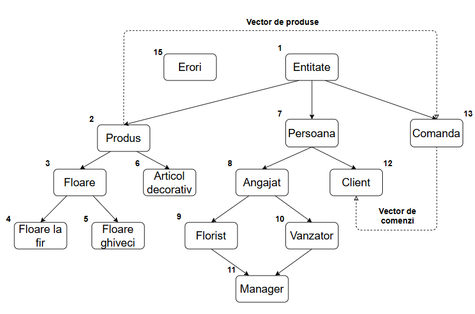
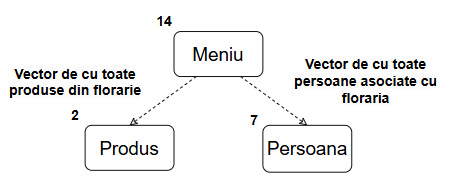

# Gestiune Boutique Floral \- Proiect POO

Acesta este proiectul meu pentru disciplina Programare Orientată pe Obiecte. M-am gândit să creez o aplicație care să ajute proprietarul unei florării (un „Boutique Floral”) să gestioneze mai ușor tot ce se întâmplă în afacerea lui: de la stocul de flori și decorațiuni, până la evidența angajaților, a clienților și a comenzilor realizate.

Din punct de vedere tehnic, am organizat codul sub forma unui arbore, unde aproape toate cele 15 clase sunt legate prin moștenire.

## **1\. Entitate – Rădăcina proiectului**

Totul pleacă de la clasa Entitate. Este o clasă abstractă care servește drept „părinte” pentru aproape tot ce există în florărie. Am pus aici o variabilă statică contorId care se asigură că fiecare obiect nou creat primește un ID unic automat. Tot aici am definit și baza pentru afișarea polimorfică, prin supraîncărcarea operatorului \<\<.

Din această clasă se ramifică cele trei mari direcții ale aplicației: **Produsele**, **Persoanele** și **Comenzile**.

### **Zona Produselor (Stocul)**

**2\. Produs:** Este prima parte pentru obiectele pe care le vindem. Introduce noțiunile de nume și preț de bază, dar și funcții virtuale pure pentru calculul prețului final și îngrijirea produsului, care vor face lucruri diferite în funcție de tipul obiectului.

**3\. Floare:** Aici regăsim produsele „vii”. Am introdus variabila gradStare (procente de prospețime), care ne ajută să știm cât de ofilită e floarea și să îi scădem prețul dacă e cazul.

* **4\. Floare la fir:** O clasă concretă pentru florile vândute individual. Aici calculăm prețul final în funcție de numărul de fire.  
* **5\. Floare la ghiveci:** Spre deosebire de fir, aici adunăm la preț și costul ghiveciului, ba chiar punem o taxă suplimentară dacă materialul este ceramica.

**6\. Articol decorativ:** Se ocupă de obiectele fără viață din magazin (vaze, felicitări etc.). Aici am implementat o „taxă de fragilitate” care se aplică automat dacă marcăm obiectul ca fiind fragil.

### **Zona Persoanelor (Resursele Umane)**

**7\. Persoana:** Baza pentru oricine intră în contact cu florăria. Reține nume, prenume și telefon, dar are și o funcție virtuală getRol() care ne spune ce caută omul respectiv în sistemul nostru.

**8\. Angajat:** De aici începem să calculăm venitul. Am lucrat cu salariul brut și am setat o bază pentru calculul salariului net. Clasa este moștenită virtual pentru a pregăti terenul pentru Manager.

* **9 & 10\. Florist & Vanzator:** Acești doi angajați au bonusuri diferite: Floristul primește bani în plus pentru buchetele create, iar Vânzătorul primește comision din vânzările făcute. Ambele clase moștenesc virtual clasa Angajat.

**11\. Manager (Moștenirea în Diamant):** Aceasta este o clasă specială. M-am gândit că un manager într-un boutique floral trebuie să știe să facă de toate: să creeze buchete și să și vândă. Astfel, clasa Manager moștenește și din Florist și din Vanzator. Primește bonusurile din ambele părți, plus un „bonus de conducere” pentru responsabilitatea sa.

### **Zona de Management și Comenzi**

**12\. Client:** Deși pare o clasă simplă, ea realizează o legătură de compoziție. Fiecare client are un vector de Comenzi, unde se salvează istoricul lui de cumpărături.

**13\. Comanda:** Reprezintă bonul fiscal al clientului. Are propriul vector de pointeri către Produs, calculând automat totalul de plată în funcție de ce am pus în coș.

**14\. Meniu:** Este „creierul” interactiv al programului. Folosește pattern-ul Singleton pentru a asigura o singură instanță. Este împărțit pe secțiuni de management (Produse, Personal, Clienți) și permite operații complete de adăugare, vizualizare, modificare și ștergere (CRUD).

**15\. Erori:** Am creat o ierarhie de excepții personalizate pentru a valida datele. De exemplu, dacă cineva introduce un preț negativ sau încearcă să facă o comandă fără produse, programul nu „crapă”, ci afișează un mesaj de eroare prietenos.

### **16\. Main**

În fișierul principal, am simulat introducerea unor date inițiale (manager, angajați, câteva flori în stoc) pentru ca aplicația să nu pornească goală, după care se lansează bucla meniului interactiv.

### **Funcții regasite in program**

În cadrul ierarhiei, clasele folosesc atât metode proprii, cât și metode preluate prin moștenire de la părinți.

**Clasa Entitate**:

* *getId()*: Returnează identificatorul unic al obiectului.  
* *afisare(ostream& out)*: Funcție virtuală pură care obligă orice obiect să aibă o metodă de afișare.  
* *operator\<\<*: Supraîncărcare pentru a permite afișarea polimorfică folosind std::cout.

**Clasa Produs**:

* *calculeazaPretFinal()*: Funcție virtuală pură pentru calcularea prețului după taxe sau reduceri.  
* *aplicaIngrijire()*: Funcție virtuală pură pentru acțiuni specifice de întreținere.  
* *getNume() / getPretBaza()*: Getteri pentru atributele principale.  
* *setPretBaza()*: Permite modificarea prețului de către administrator.

**Clasa Persoana**:

* *getRol()*: Funcție virtuală pură care returnează tipul persoanei (Florist, Client etc.).  
* *areTelefonValid()*: Verifică dacă numărul de telefon are exact 10 cifre.

**Clasa Angajat**:

* *calculeazaVenit()*: Calculează salariul net pornind de la cel brut.

**Clasa Floare**:

* *aplicaIngrijire()*: Crește gradul de prospețime al florii cu 10%.

**Clasa FloareLaFir**:

* *calculeazaPretFinal()*: Aplică reduceri dacă floarea este ofilită și înmulțește cu numărul de fire.

**Clasa FloareGhiveci**:

* *calculeazaPretFinal()*: Adaugă costul ghiveciului și o taxă extra pentru materialul de ceramică.

**Clasa ArticolDecorativ**:

* *calculeazaPretFinal()*: Adaugă o taxă de 10% dacă obiectul este marcat ca fragil.  
* *aplicaIngrijire()*: Simulează ștergerea de praf și verificarea integrității.

**Clasa Florist**:

* *calculeazaVenit()*: Adaugă la salariu un bonus pentru fiecare buchet creat.

**Clasa Vanzator**:

* *calculeazaVenit()*: Adaugă la salariu un comision fix pentru fiecare vânzare efectuată.

**Clasa Manager**:

* *calculeazaVenit()*: Combină bonusurile de Florist și Vânzător cu un bonus special de conducere.

**Clasa Client**:

* *adaugaComanda(Comanda& c)*: Salvează o comandă nouă în istoricul clientului.

**Clasa Comanda**:

* *adaugaProdus(Produs\* p)*: Adaugă un pointer către un produs în lista curentă.  
* *calculeazaTotal()*: Parcurge lista de produse și sumează prețurile lor finale.

### **Functiile polimorfisme**

Deasemenea, cum se poate observa si în lista lunga de functii de mai sus, am utilizat metode virtuale pentru a permite claselor „copil” să își personalizeze comportamentul (polimorfism), lucru esențial pentru funcții precum calculul prețului sau afișarea datelor.

* **`afisare(ostream& out)`**: Aceasta este funcția polimorfică de bază. Fiind declarată virtuală pură în `Entitate`, ea obligă toate celelalte clase (Produs, Persoană, Angajat, Comandă etc.) să ofere propria implementare de afișare.

* **`operator<<`**: Deși tehnic este o funcție `friend`, ea acționează polimorfic deoarece apelează metoda virtuală `afisare` a obiectului primit ca parametru.

* **`calculeazaPretFinal()`**: Este o funcție virtuală pură în `Produs`. Ea se comportă polimorfic în:  
  * *`FloareLaFir`*: aplică reduceri de ofilire și înmulțește cu numărul de fire.  
  * *`FloareGhiveci`*: adaugă costul ghiveciului și taxele de material.  
  * *`ArticolDecorativ`*: adaugă taxa de fragilitate.

* **`aplicaIngrijire()`**: Declarată în `Produs`, această funcție permite tratarea diferită a produselor:  
  * În *`Floare`*, ea crește gradul de prospețime.  
  * În *`ArticolDecorativ`*, ea simulează ștergerea de praf.

* **`getRol()`**: Este o funcție virtuală pură în `Persoana`. Ea permite sistemului să identifice polimorfic tipul persoanei fără a verifica manual tipul de date:  
  * Returnează "Florist", "Vanzator", "Manager" sau "Client".

* **`calculeazaVenit()`**: Declarată virtuală în clasa `Angajat`, această funcție permite calcularea automată a veniturilor totale:  
  * *`Florist`*: adaugă bonusul per buchet.  
  * *`Vanzator`*: adaugă comisionul per vânzare.  
  * *`Manager`*: combină bonusurile din ambele ramuri ale moștenirii în diamant.

